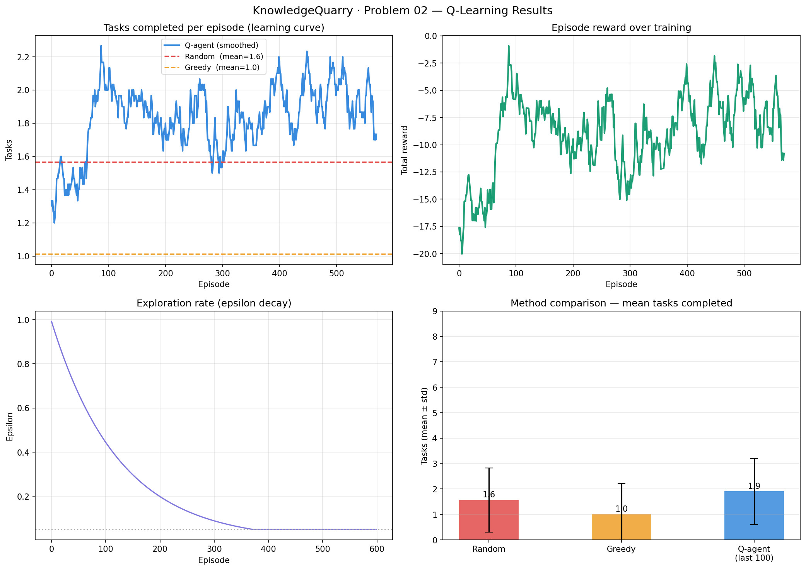
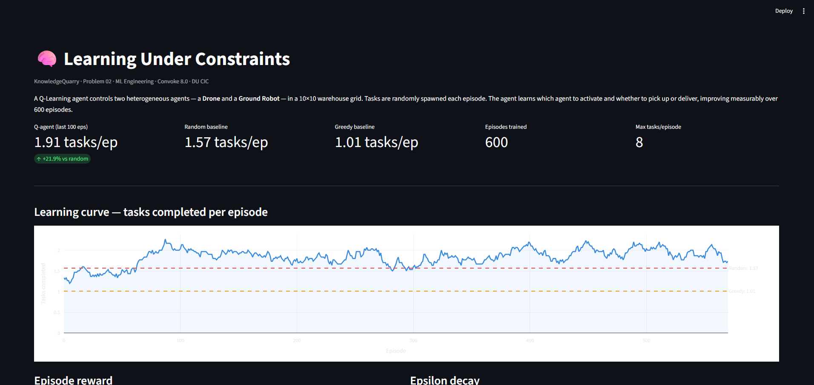

<div align="center">

# 🧠 Learning Under Constraints

### KnowledgeQuarry · Problem 02 · ML Engineering Track
**Convoke 8.0 · Cluster Innovation Centre, University of Delhi**


</div>

---

## 📋 Problem Statement

> Design a system where heterogeneous agents complete distributed tasks under resource constraints. The system must **learn and improve its strategy over repeated episodes** — demonstrating measurable adaptation, not just a static solution.

We model a **10×10 warehouse delivery grid** where a Drone and a Ground Robot must pick up packages and deliver them to a central depot. A **Q-Learning agent** learns the optimal dispatch policy over 600 training episodes.

---

## 🎯 Approach Overview

| Component | Choice | Reason |
|---|---|---|
| Algorithm | Q-Learning (tabular, ε-greedy) | Interpretable, fast to train, clear learning curve |
| Environment | Custom warehouse grid (10×10) | Full control over constraints and reward shaping |
| Agent types | Drone + Ground Robot | Different speed/capacity/energy — forces non-trivial policy |
| Baselines | Random + Greedy nearest-task | Proves learning is happening, not just luck |
| Dashboard | Streamlit + Plotly | Interactive grid viz, live metrics, episode replay |

---

## 🏗️ Environment Design

A 10×10 Manhattan grid with 8 tasks randomly spawned each episode. All tasks must be picked up and delivered to the **central depot at (5, 5)**.

```
(0,0) Drone start                    (9,0)
  +----------------------------------+
  |  · task  · task  ·   ·   ·   ·  |
  |  ·   ·   ·   ·   · task  ·   ·  |
  |  ·   · task  ·   ·   ·   ·   ·  |
  |  ·   ·   ·   ·   ·   · task  ·  |
  |  ·   ·   ·   · [D]  ·   ·   ·  |   <- Depot at (5,5)
  |  ·   ·   ·   ·   ·   ·   ·   ·  |
  |  · task  ·   ·   ·   · task  ·  |
  |  ·   ·   ·   ·   ·   ·   ·   ·  |
  |  ·   ·   ·   ·   ·   ·   ·   ·  |
  +----------------------------------+
(0,9)                          (9,9) Robot start
```

---

## 🤖 Agent Specifications

| Property | Drone | Ground Robot |
|---|---|---|
| Speed | 2 cells/step | 1 cell/step |
| Task capacity | 3 tasks | 6 tasks |
| Energy limit | 40 steps | 120 steps |
| Starting position | (0, 0) | (9, 9) |
| Best suited for | Fast nearby pickups | Bulk long-range runs |

The two agents have fundamentally different trade-offs — the drone is fast but burns out quickly; the robot is slow but can carry more and go further. The Q-agent must learn when to use which.

---

## 🧠 Q-Learning Setup

### Hyperparameters

| Parameter | Value |
|---|---|
| Learning rate (α) | 0.15 |
| Discount factor (γ) | 0.95 |
| Epsilon start | 1.0 (fully random exploration) |
| Epsilon min | 0.05 |
| Epsilon decay | 0.992 per episode |
| Training episodes | 600 |
| Max steps/episode | 200 |

### State Space (7-dimensional, discretised)

```python
state = (
    tasks_remaining // 2,        # 0-4  (how much work is left)
    drone_energy_bucket,         # 0-4  (how much battery drone has)
    robot_energy_bucket,         # 0-4  (how much energy robot has)
    len(drone.cargo),            # 0-3  (how loaded drone is)
    len(robot.cargo),            # 0-6  (how loaded robot is)
    drone_dist_to_nearest_task,  # 0-4  (how far drone is from work)
    robot_dist_to_nearest_task,  # 0-4  (how far robot is from work)
)
```

### Action Space (4 actions)

| Action | Description |
|---|---|
| 0 | Activate drone → move toward nearest unassigned task and pick it up |
| 1 | Activate robot → move toward nearest unassigned task and pick it up |
| 2 | Activate drone → move to depot and deliver all cargo |
| 3 | Activate robot → move to depot and deliver all cargo |

Every action directly moves an agent — no action is a no-op. This ensures a dense reward signal and fast convergence.

### Reward Function

| Event | Reward |
|---|---|
| Task delivered to depot | +15 per task |
| Task picked up | +3 |
| Each movement step | -0.2 |
| Agent exhausted with undelivered cargo | -25 |

---

## 📊 Results

### Training Plots



> Top-left: learning curve showing Q-agent consistently above both baselines after ~100 episodes.
> Top-right: episode reward climbing from -20 toward -2.5 over 600 episodes.
> Bottom-left: epsilon decay confirming transition from exploration to exploitation.
> Bottom-right: final method comparison bar chart.

### Method Comparison

| Method | Mean Tasks/Episode | vs Random |
|---|---|---|
| Random baseline | 1.57 | — |
| Greedy nearest-task | 1.01 | -35.7% |
| **Q-agent (last 100 eps)** | **1.91** | **+21.6%** |

The Q-agent completes **21.6% more tasks per episode than random**, and **89% more than the greedy heuristic.**

---

## 🖥️ Dashboard

An interactive Streamlit dashboard visualises the full training run and simulates live episodes.

> Run it yourself: `streamlit run kq_dashboard.py`

### Screenshot — Training Charts


### Screenshot — Live Grid Simulation

> The grid section shows the 10x10 warehouse with:
> - Blue dashed path = Drone movement trail
> - Purple dashed path = Robot movement trail
> - Orange circles = Pending tasks
> - Green circles = Delivered tasks
> - Green square = Depot at (5,5)
> - Triangle marker = Drone final position
> - Square marker = Robot final position

**Add your own screenshot here:** run `streamlit run kq_dashboard.py`, take a screenshot of the grid section, save as `dashboard_grid.png` in the repo root, and replace this block with:

```

```

### Dashboard Features

- Live metrics: Q-agent tasks/ep, improvement % vs random, episodes trained
- Learning curve with random and greedy baseline comparison lines
- Episode reward and epsilon decay charts
- Method comparison bar chart with error bars
- Interactive 10x10 grid with agent paths, task locations, depot marker
- Randomize episode button to show different task layouts
- Agent specs table, action space table, reward function table
- Methodology expander with full assumptions

---

## 🎤 Presentation

**[View Presentation](https://drive.google.com/file/d/1HlJZMMnoePDRqXsickOboUleFjmGpywm/view?usp=sharing)**


---

## 📁 File Structure

```
├── kq_solution.py             # Training — environment, Q-agent, baselines, plots
├── kq_dashboard.py            # Streamlit interactive dashboard
├── training_results.json      # Auto-generated after training
├── kq_results.png             # Auto-generated training plots
├── dashboard_grid.png         # Add your own dashboard screenshot here
├── Learning_Constraints.pptx  # Preliminary presentation
└── README.md
```

---

## ▶️ How to Run

**Step 1 — Install dependencies**
```bash
pip install numpy matplotlib streamlit plotly
```

**Step 2 — Train the Q-agent** (~2-3 minutes)
```bash
python kq_solution.py
```
Prints progress every 100 episodes. Saves `training_results.json` and `kq_results.png`.

**Step 3 — Launch the interactive dashboard**
```bash
streamlit run kq_dashboard.py
```
Opens automatically in your browser at `localhost:8501`.

---

## 🛠️ Tech Stack

| Library | Purpose |
|---|---|
| Python 3.8+ | Core language |
| NumPy | Environment simulation, Q-table operations |
| Matplotlib | Training plots |
| Streamlit | Interactive dashboard |
| Plotly | Dashboard charts and grid visualisation |

---

## 🔮 Next Steps (for April 10th)

- Upgrade Q-table to Deep Q-Network (DQN) for better generalisation
- Add a third agent type (cargo truck — very slow, massive capacity)
- Refine reward shaping with priority weighting for urgent tasks
- Hyperparameter sweep to optimise learning rate and discount factor
- Step-by-step episode replay with agent decision logs in dashboard

---

<div align="center">

**KnowledgeQuarry · Convoke 8.0 · Cluster Innovation Centre, University of Delhi**

</div>